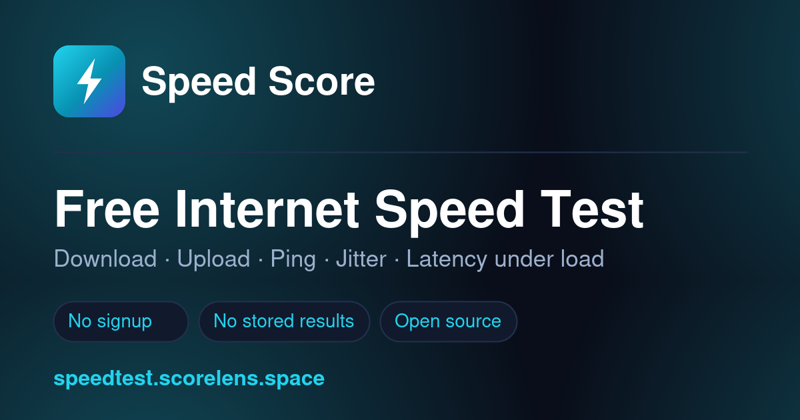

<p align="center">
  
</p>

<h1 align="center">Speed Score</h1>

<p align="center">
  A self-hostable internet speed test that measures what other speed tests hide:<br>
  <strong>latency under load</strong>.
</p>

<p align="center">
  <a href="https://speedtest.scorelens.space/"><strong>Live demo →</strong></a>
</p>

<p align="center">
  
  
  
  
</p>

---

## Why another speed test?

Most speed tests report your ping while the connection is **idle** — which is never when
problems happen. Your video call doesn't drop when the line is quiet; it drops when someone
else starts a large upload.

Speed Score measures latency **continuously**, including while the connection is saturated,
and reports both numbers. The gap between them is **bufferbloat**: your router queueing
packets it can't send fast enough, with everything interactive stuck behind that queue.

That single number explains most "my internet is fast but feels slow" complaints — and
almost no consumer speed test shows it.

## What it measures

| Metric | Description |
| --- | --- |
| **Download / upload** | Sustained throughput over multiple parallel connections |
| **Idle latency** | Round-trip time with the line quiet — min, median and 75th percentile |
| **Loaded latency** | Round-trip time *during* the download and upload stages |
| **Bufferbloat** | Loaded minus idle latency, the number that predicts call and game quality |
| **Jitter** | Latency variation, measured separately for idle, download and upload |
| **Stability** | How steady throughput stays across the run |
| **Request loss** | Percentage of probe requests that never came back |

Results are converted into plain-English ratings for **video streaming, online gaming and
video calls** — and when a rating isn't "Great", the UI names the specific bottleneck
rather than just showing a number.

## Features

- **Runs entirely on your own server.** No third-party test infrastructure, no API keys.
- **Nothing is stored.** Test payloads are random bytes discarded immediately after
  transfer. No result history, no per-visitor records.
- **No build step.** No `npm install`, no bundler, no framework. Vanilla JS and plain PHP.
- **Zero runtime dependencies.** No Composer packages.
- **Light and dark themes**, respecting `prefers-color-scheme`, with no flash on load.
- **Fully responsive**, tested from 380 px up.
- **SEO and AI-search ready** — structured data, `llms.txt`, sitemap, OG cards.
- **Analytics optional.** With no measurement ID configured, zero third-party scripts load.

## Quick start

**Requirements:** PHP 7.4 or newer and any web server. That's it.

```bash
git clone https://github.com/iampopye/speedtest.git
cd speedtest
cp includes/config.example.php includes/config.php
php -S localhost:8000
```

Open <http://localhost:8000>.

> **Note on the built-in server:** PHP's development server is single-threaded, so parallel
> download streams queue behind each other and the measured speeds will be far lower than
> reality. It's fine for working on the UI — benchmark against Apache, nginx or Caddy.

## Configuration

Everything lives in `includes/config.php`, which is gitignored so your IDs never land in a
fork. Copy `includes/config.example.php` to create it.

| Constant | Default | Purpose |
| --- | --- | --- |
| `SITE_URL` | `https://speedtest.scorelens.space` | Base URL for canonicals, OG tags and schema. No trailing slash. |
| `SITE_NAME` | `Speed Score` | Product name in the header, titles and structured data. |
| `REPO_URL` | this repo | Powers the GitHub link in the nav. Set to `''` to hide it. |
| `GA_MEASUREMENT_ID` | `''` | GA4 ID. **Empty means no Google script is requested at all.** |
| `GA_PRIVACY_MODE` | `true` | Sends hits with IP anonymisation and ad personalisation off. |
| `GOOGLE_SITE_VERIFICATION` | `''` | Search Console meta-tag token. |
| `BING_SITE_VERIFICATION` | `''` | Bing Webmaster token — Bing's index feeds Microsoft Copilot. |

Rebranding is a two-step job: change `SITE_NAME`, then edit
`assets/img/logo-mark.svg` and run `php tools/generate-assets.php` to regenerate the
favicon set, PWA icons and social card. Nothing else hardcodes the artwork.

## Deploying

The repo is a document root — upload it and you're done. No build, no migrations.

**Apache** works out of the box; the bundled `.htaccess` handles HTTPS and `www`
redirects, caching, security headers and error pages.

**One rule matters more than any other:**

```apache
# Never compress the test payloads — it corrupts the measurements
SetEnvIfNoCase Request_URI "^/backend/" no-gzip dont-vary
```

The download endpoint streams incompressible random data. If your server gzips it anyway,
you're measuring your CPU rather than your connection. On **nginx**, the equivalent is:

```nginx
location /backend/ {
    gzip off;
    add_header Cache-Control "no-store, no-cache, must-revalidate";
}
```

Also make sure `/data/` and `/includes/` are not web-reachable. Both ship with their own
`.htaccess` denying access; on nginx, add explicit `deny all` blocks.

## How the measurement works

1. **Probe** — a burst of small requests to `backend/empty.php` establishes idle latency
   and jitter. The fastest round trip becomes your ping.
2. **Download** — the browser pulls incompressible random data from `backend/garbage.php`
   over several parallel connections for ~12 seconds.
3. **Upload** — the direction flips; the browser pushes random data to `backend/empty.php`,
   which drains and discards it.
4. **Throughout** — small timing probes keep running in the background during both transfer
   stages, producing the loaded-latency and bufferbloat figures.

Random data is generated with `random_bytes()` so it cannot be compressed in transit,
and no part of it is ever written to disk. See
[`methodology.php`](methodology.php) for the scoring thresholds and their sources.

## Project structure

```
├── index.php               Speed test UI and homepage copy
├── backend/
│   ├── garbage.php         Download endpoint — streams random data
│   ├── empty.php           Ping target and upload sink
│   ├── getip.php           Connection info (IP, ISP, server location)
│   └── lib/geo.php         Geo lookup, cached at /24 and /48 granularity
├── assets/
│   ├── js/speedtest.js     Measurement engine
│   ├── js/theme.js         Theme toggle
│   ├── css/style.css       All styles
│   └── img/                Logo, favicons, social card
├── includes/               Shared header/footer, config, bootstrap
├── blog/                   Ten long-form guides
├── tools/generate-assets.php   Regenerates all brand artwork
└── data/geocache/          Runtime cache (gitignored)
```

## Privacy

The geo cache stores ISP and city data keyed by a hash of the **coarsened** network
(`/24` for IPv4, `/48` for IPv6) — never a full address, and never tied to a result. Test
payloads are discarded the moment they finish transferring. Nothing about a test run is
written to disk.

## Contributing

Issues and pull requests are welcome — see [CONTRIBUTING.md](CONTRIBUTING.md). Good first
contributions:

- nginx and Caddy configuration examples
- A Docker Compose setup
- Translations
- Additional measurement stages (packet loss, DNS resolution time, IPv6 reachability)

## License

MIT — see [LICENSE](LICENSE). Published by
[RioCloud Solutions](https://riocloudsolutions.com), Chandigarh, India.
